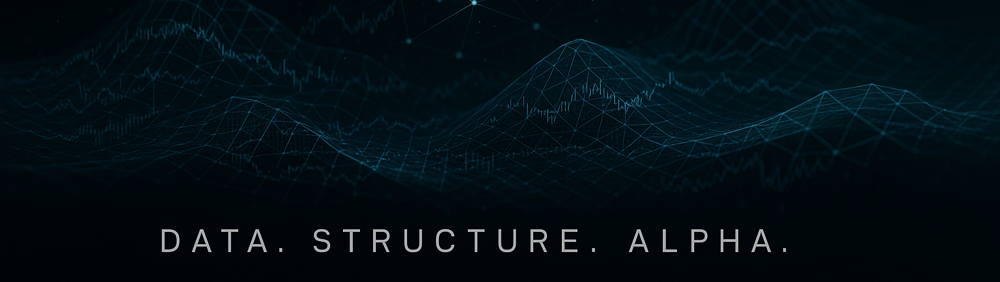
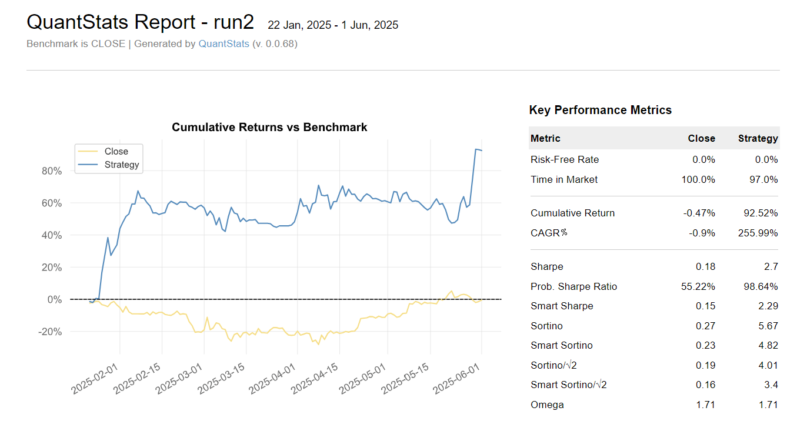
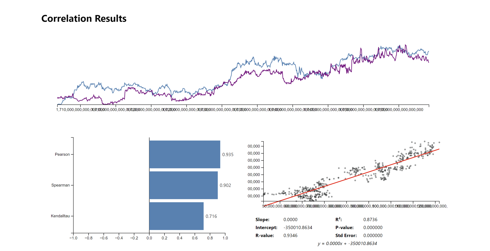
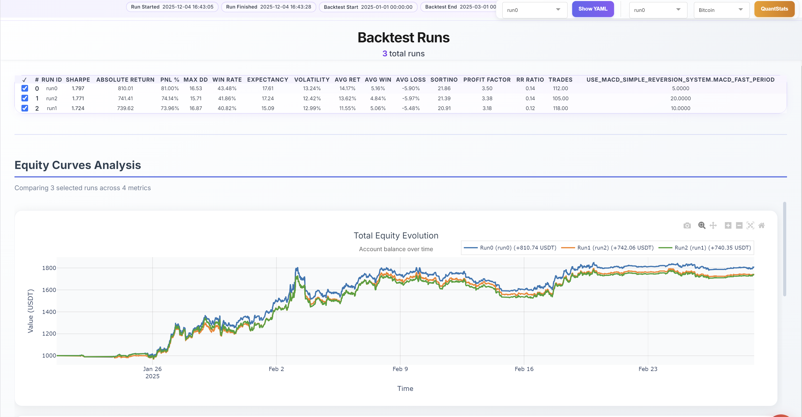
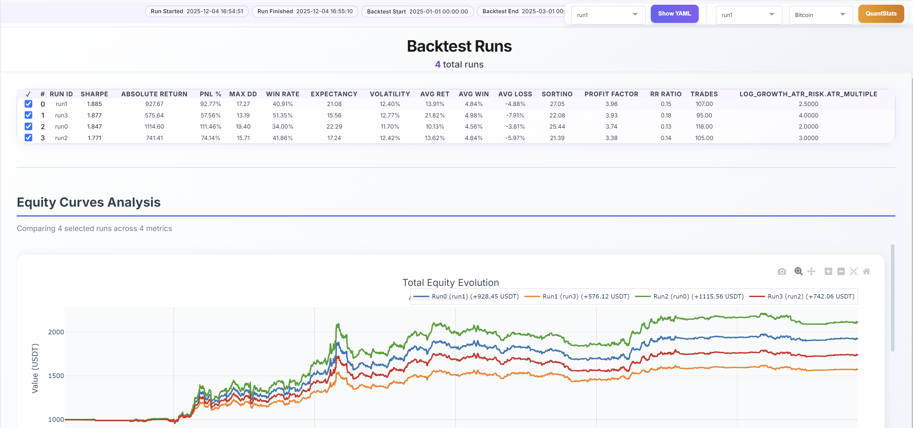
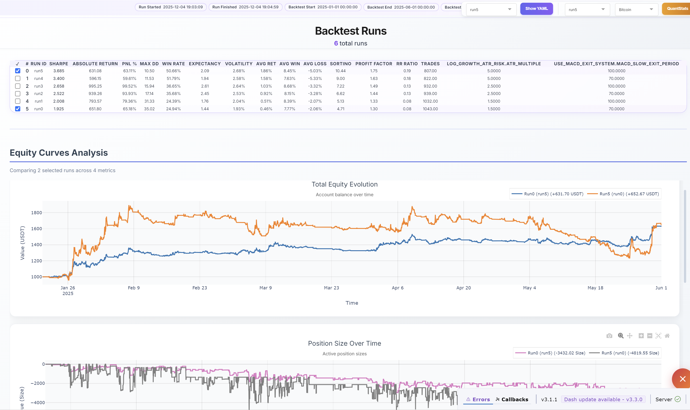

 

*Institutional-Grade Quantitative Trading Infrastructure*

---

 

[Overview](#overview) · [Architecture](#system-architecture) · [Edge](#competitive-edge) · [Strategies](#trading-strategies) · [Tools](#analytical-tools) · [Installation](#installation)

---

 

## Overview

**AlgorithmicTrader** is a professional-grade quantitative trading framework built on top of [NautilusTrader](https://nautilustrader.io) — a high-performance backtesting and live trading engine written in Rust with Python bindings, trusted by quantitative hedge funds and proprietary trading firms worldwide.

This framework represents the intersection of **quantitative research**, **software engineering excellence**, and **institutional execution infrastructure**. We engineer self-adapting trading systems that dynamically evolve with changing market regimes — the same methodology employed by Renaissance Technologies and Two Sigma.

 

 

> *"In a market where milliseconds determine winners and losers, we chose to build infrastructure that thinks in nanoseconds. Where others see complexity, we see opportunity. This is not just code — it is a competitive weapon forged through relentless iteration and an obsession with excellence."*

---

## Our Vision

We are building more than a trading system — we are engineering a **self-evolving quantitative infrastructure** designed to compound returns across decades, not months.

 

### Long-Term Roadmap

| Phase | Objective | Status |
|:------|:----------|:-------|
| **Foundation** | Institutional-grade backtesting infrastructure with NautilusTrader | ✓ Complete |
| **Robustness** | Walk-forward validation, parameter stability analysis, regime detection | ✓ Complete |
| **Scale** | Multi-strategy orchestration with portfolio-level risk management | In Progress |
| **Intelligence** | Temporal Fusion Transformers for adaptive signal generation | Planned |
| **Autonomy** | Self-optimizing systems with continuous learning pipelines | Planned |

 

### Core Principles

**Extreme Robustness Over Short-Term Performance**
We prioritize strategies that survive regime changes, black swan events, and prolonged drawdowns. A system that compounds at 15% annually for 20 years vastly outperforms one that returns 100% before catastrophic failure.

**Transformer-Based Future**
Traditional technical indicators capture linear relationships. We are transitioning toward **attention-based architectures** that learn complex, non-linear market dynamics — identifying patterns invisible to conventional quantitative methods.

**Continuous Evolution**
Markets adapt. Strategies decay. Our infrastructure is designed for perpetual iteration: automated retraining pipelines, out-of-sample monitoring, and graceful strategy rotation when alpha erodes.

 

---

## System Architecture

We have engineered a comprehensive ecosystem on top of NautilusTrader's Rust core, covering the complete quantitative trading lifecycle — from raw market data ingestion to post-trade analytics.

 

### What We Built

| Layer | Components | Function |
|:------|:-----------|:---------|
| **Execution** | `run_backtest.py`, `backtest_config.py` | Orchestration layer connecting strategies to NautilusTrader engine |
| **Strategies** | `strategies/` framework | Modular signal generation with risk overlays and position management |
| **Data Pipeline** | `data_loader.py`, Parquet catalogs | High-throughput ingestion for multi-venue tick and bar data |
| **Analytics** | QuantStats integration | Institutional tear sheets with 50+ performance metrics |
| **Research Tools** | `correlation_analyzer.py`, `param_analyzer.py` | Parameter stability and cross-asset dependency analysis |
| **Visualization** | Plotly/Matplotlib dashboards | Real-time P&L tracking and regime visualization |

 

---

## Competitive Edge

 

### Why We Outperform

| Dimension | Retail Frameworks | **AlgorithmicTrader** |
|:----------|:------------------|:----------------------|
| **Latency** | Milliseconds | **Sub-microsecond** (Rust) |
| **Simulation** | OHLC, no fees | **Tick-level**, realistic fills |
| **Validation** | In-sample only | **Walk-forward**, regime-aware |
| **Risk** | Post-hoc | **Real-time enforcement** |

**Three pillars of our edge:**

1. **Microstructure Fidelity** — We model order book dynamics, network latency, and venue-specific fee structures with precision. Strategies validated in our environment translate directly to live performance.
2. **Regime Adaptation** — Markets are non-stationary. Our systems dynamically adjust parameters based on volatility clustering and correlation regime shifts, ensuring robustness across market conditions.
3. **Research Velocity** — Our modular architecture enables rapid hypothesis testing. From initial concept to fully validated backtest in hours, not weeks — a critical advantage in competitive markets.

 

---

## Trading Strategies

### Future: Transformer-Based Alpha

We are implementing **Temporal Fusion Transformers** for next-generation signal generation — the same architecture Google uses for state-of-the-art time series forecasting:

- Multi-horizon attention across minute, hourly, and daily timeframes
- Cross-asset fusion layers for market regime detection
- Confidence-weighted position sizing with calibrated uncertainty estimates

 

### Current: Short Low Market Cap Strategy

Our flagship strategy exploits structural inefficiencies in low-capitalization cryptocurrency markets — a segment where institutional players cannot operate due to liquidity constraints.

| Aspect | Detail |
|:-------|:-------|
| **Thesis** | Mean reversion after liquidity-driven pumps in shallow order books |
| **Signal** | Momentum exhaustion detection: parabolic price moves combined with declining volume and RSI divergence |
| **Risk** | ATR-based dynamic stops, per-asset exposure limits, portfolio-level correlation constraints |

 

 

---

## Analytical Tools

### QuantStats Integration

Comprehensive performance attribution matching institutional standards. Every backtest generates detailed tear sheets analyzing risk-adjusted returns, drawdown characteristics, and return distributions across 50+ metrics.

 

### Correlation Analyzer

Sophisticated cross-asset dependency analysis for portfolio construction. We examine rolling correlation matrices, tail-dependence structures during market stress, and hierarchical cluster detection to ensure true diversification — not just the illusion of it.

 

### Parameter Stability Analyzer

We reject curve-fitting. Our parameter analyzer visualizes strategy performance across the entire parameter space, identifying robust **plateaus of profitability** rather than fragile peaks that collapse out-of-sample.

 

 

 

---

 

## The Bottom Line

**AlgorithmicTrader** represents institutional-grade infrastructure built from first principles:

| | |
|:--|:--|
| Rust execution core | Nanosecond-precision data handling |
| Walk-forward validation | Production-ready architecture |
| Real-time risk controls | Comprehensive analytics suite |

This project demonstrates the same engineering rigor and quantitative methodology applied at top-tier systematic trading firms.

 

**Built for precision. Engineered for alpha.**

---

*For collaboration or inquiries, please open an issue.*

 

[Back to Top](#overview)

